# Relic Architecture Guide

## System Overview

Relic is a tabletop augmented reality real-time strategy (RTS) sandbox built in Unity for Meta Quest 3, with a non-AR debug mode for development and testing.

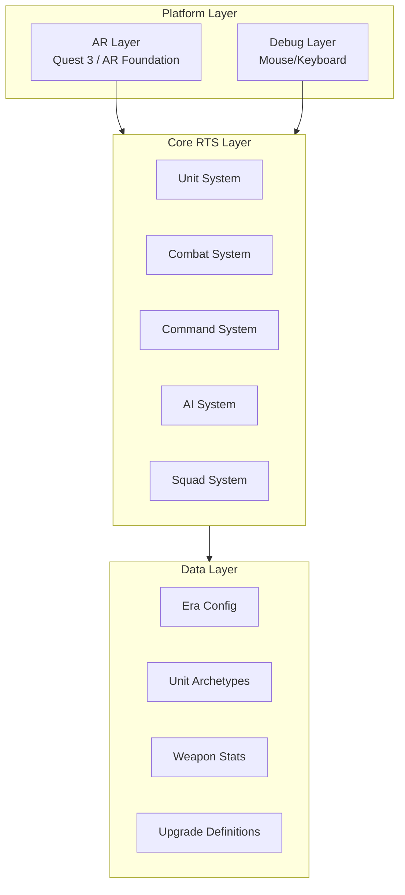

---

## Core Systems

### 1. Unit System

Manages individual unit instances, including spawning, health, movement, and death.

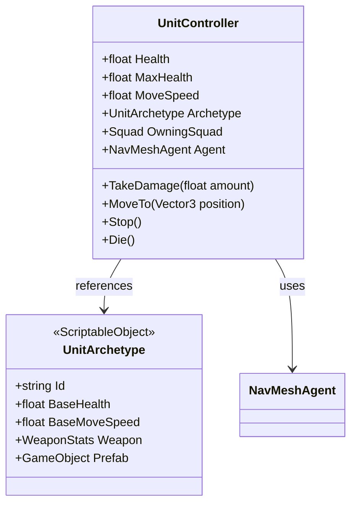

### 2. Combat System

Handles per-bullet hit chance evaluation with range, elevation, and upgrade modifiers.

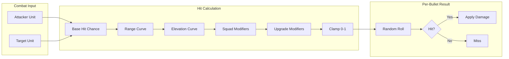

#### Hit Chance Formula

```
hit_chance = base_hit_chance
           * range_curve(distance)
           * elevation_curve(height_diff)
           * squad_accuracy_multiplier
           * upgrade_modifiers

final_hit = clamp(hit_chance, 0, 1)
damage = base_damage * squad_damage_multiplier * upgrade_damage_modifier
```

### 3. Command System

Processes player commands for unit control.

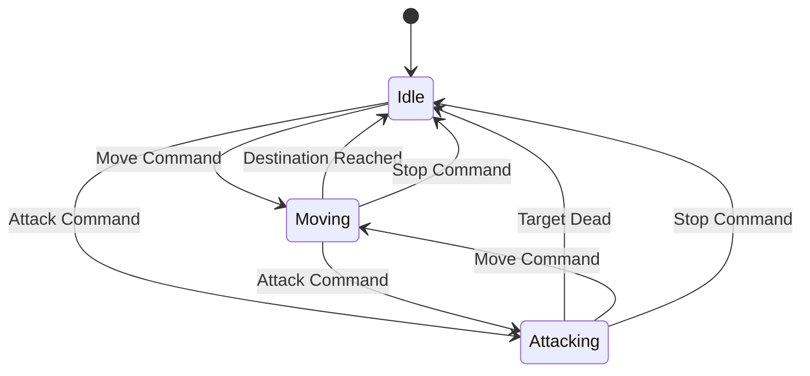

**Command Types:**
- `Move` - Navigate unit to target position
- `Attack` - Engage target unit
- `Stop` - Halt current action

### 4. Squad System

Groups units for collective buffs and coordination.

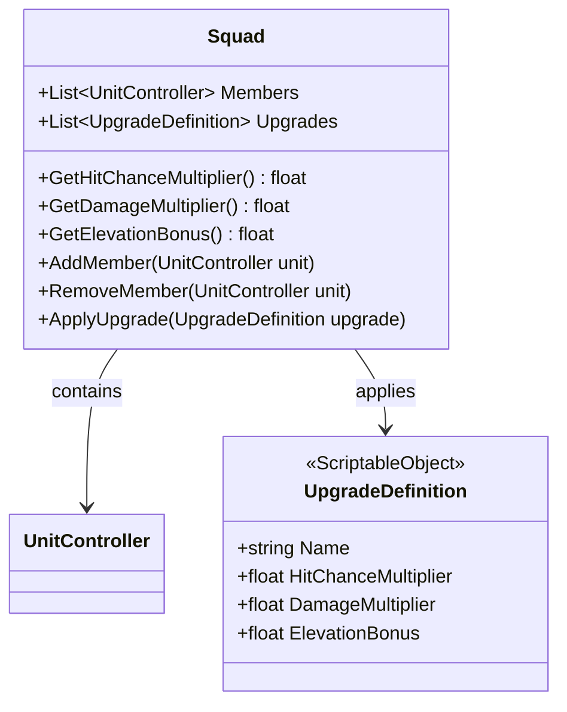

### 5. AI System

Basic state machine for autonomous unit behavior.

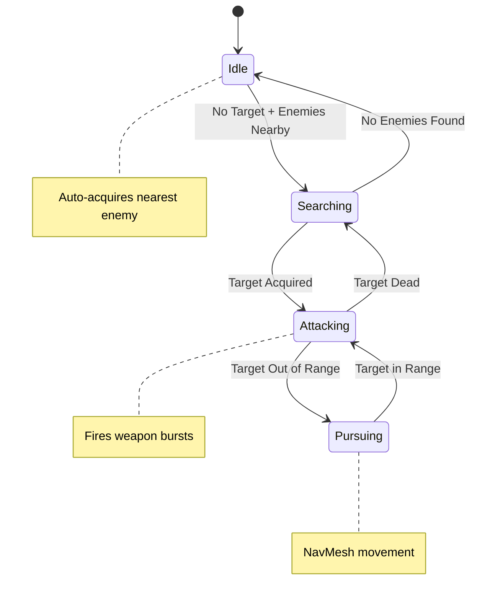

---

## Data Architecture

All game data is defined via Unity ScriptableObjects for easy tuning and era swapping.

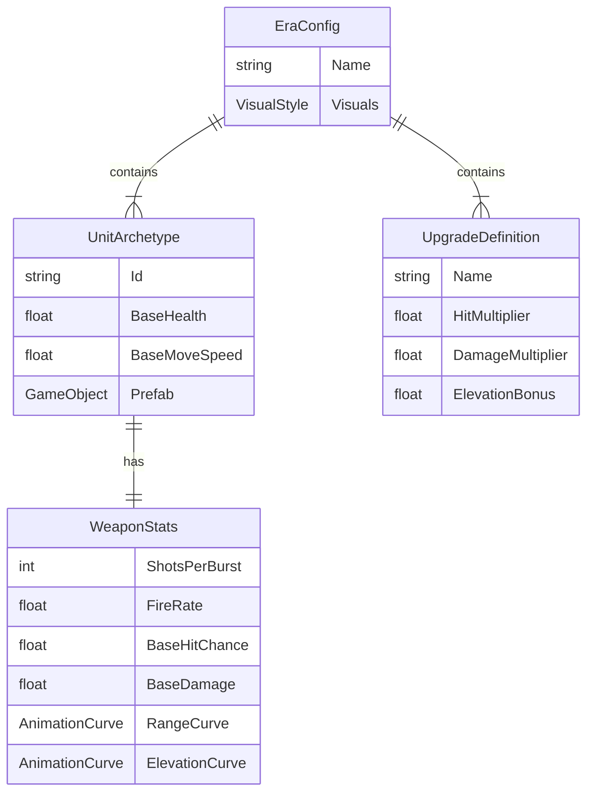

### Era Configurations

Four eras with distinct unit archetypes and visuals:

| Era | Archetype Examples | Visual Theme |
|-----|-------------------|--------------|
| Ancient | Spearmen, Archers, Cavalry | Bronze, Stone, Leather |
| Medieval | Knights, Crossbowmen, Pikemen | Steel, Chainmail, Heraldry |
| WWII | Riflemen, MG Teams, Tanks | Olive Drab, Camouflage |
| Future | Marines, Mechs, Drones | Sci-fi, Energy Weapons |

---

## Scene Architecture

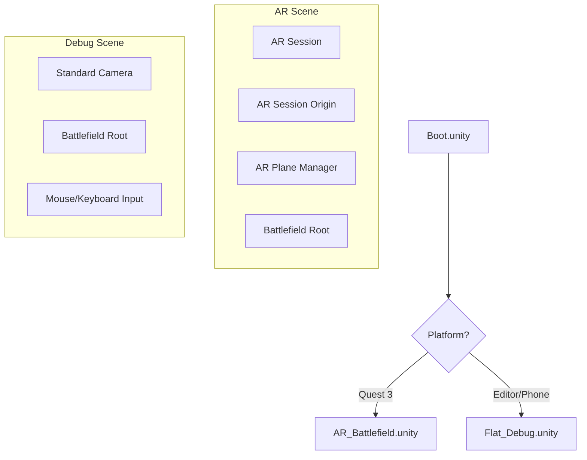

### Battlefield Structure

```
BattlefieldRoot (Prefab)
├── GroundPlane
├── Obstacles/
│   ├── Hill_01
│   ├── Cover_01
│   └── ...
├── SpawnPoints/
│   ├── Team1_Spawn
│   └── Team2_Spawn
├── NavMesh (baked)
└── UI/
    └── WorldSpacePanel
```

---

## Input Handling

### Debug Mode (Mouse/Keyboard)

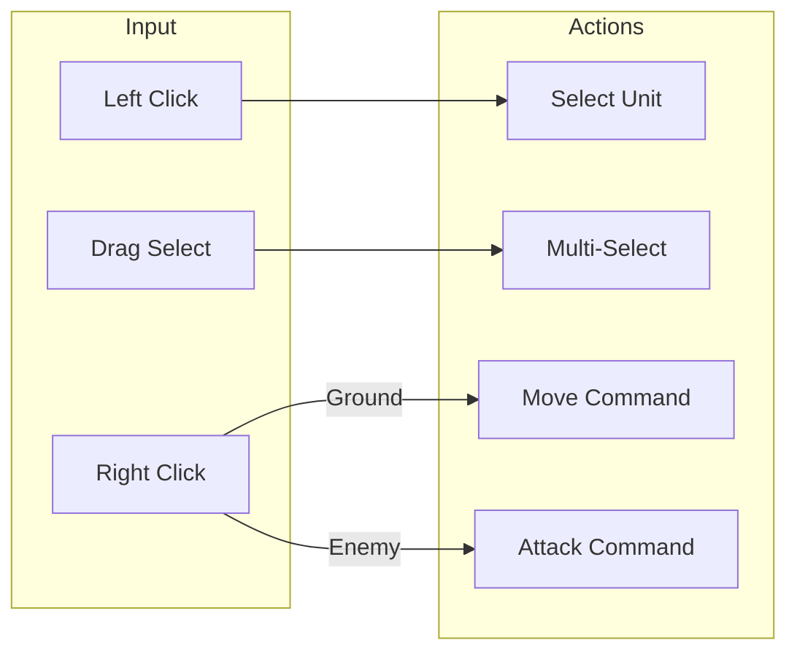

### AR Mode (Quest 3 Controllers)

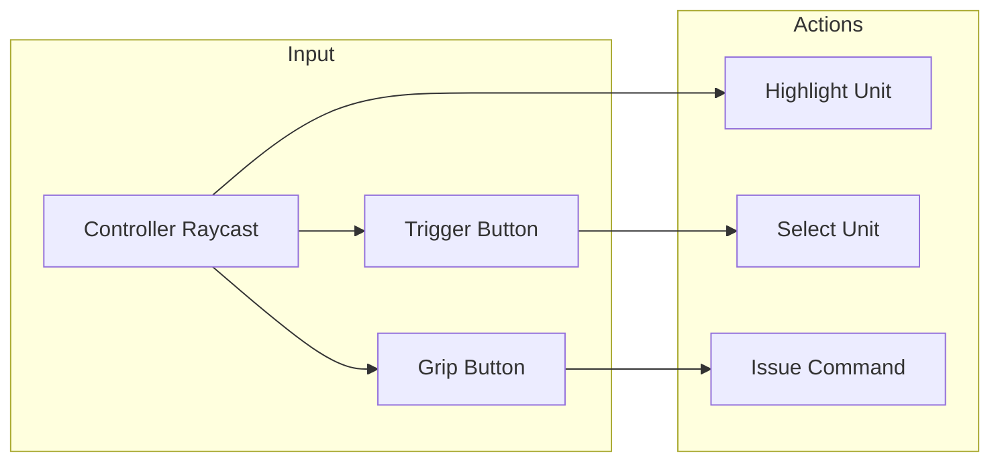

---

## Performance Architecture

### Central Tick Manager

Replaces per-unit `Update()` calls with a centralized tick system.

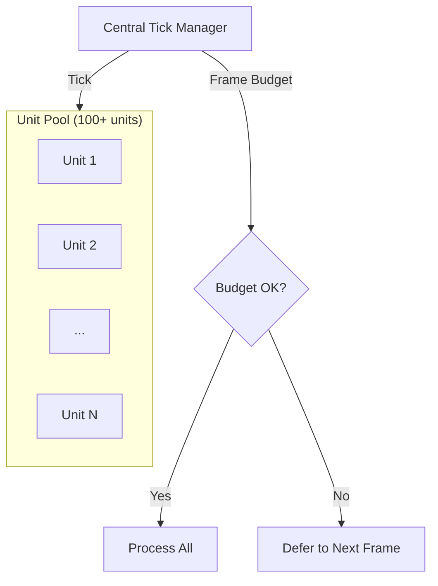

### Optimization Strategies

| Technique | Purpose | Target |
|-----------|---------|--------|
| Object Pooling | Reduce instantiation | Units, Bullets |
| GPU Instancing | Batch draw calls | Unit Meshes |
| LOD System | Reduce distant poly count | Unit Models |
| Central Tick | Reduce Update overhead | Unit Controllers |
| Bullet Aggregation | Optional: reduce bullet count | High fire-rate weapons |

---

## Directory Structure

```
/Assets
├── /Scripts
│   ├── /CoreRTS           # Platform-independent RTS logic
│   │   ├── UnitController.cs
│   │   ├── CombatSystem.cs
│   │   ├── CommandSystem.cs
│   │   ├── SquadSystem.cs
│   │   └── AIStateMachine.cs
│   ├── /ARLayer           # AR-specific features
│   │   ├── BattlefieldPlacer.cs
│   │   ├── ARInputHandler.cs
│   │   └── ARSelectionVisuals.cs
│   └── /UILayer           # UI components
│       ├── WorldSpaceUI.cs
│       ├── UnitHealthBar.cs
│       └── SelectionIndicator.cs
├── /Configs               # ScriptableObject configs
│   ├── /Eras
│   │   ├── Ancient.asset
│   │   ├── Medieval.asset
│   │   ├── WWII.asset
│   │   └── Future.asset
│   ├── /Archetypes
│   │   └── ...
│   ├── /Weapons
│   │   └── ...
│   └── /Upgrades
│       └── ...
├── /Art
│   ├── /Shared            # Common assets
│   ├── /Ancient           # Era-specific art
│   ├── /Medieval
│   ├── /WWII
│   └── /Future
├── /Scenes
│   ├── Boot.unity         # Entry point
│   ├── AR_Battlefield.unity
│   └── Flat_Debug.unity   # Non-AR testing
└── /Prefabs
    ├── BattlefieldRoot.prefab
    ├── /Units
    └── /Effects

/docs
├── milestones.md          # Kyle's roadmap (source of truth)
├── ARCHITECTURE.md        # This file
├── CODING_STANDARDS.md    # C#/Unity conventions
└── TESTING.md             # Test strategy
```

---

## Technology Stack

| Component | Technology |
|-----------|------------|
| Engine | Unity 6.3 LTS (6000.3.0f1) |
| Rendering | Universal Render Pipeline (URP) |
| AR | AR Foundation + Meta XR SDK |
| Input | XR Interaction Toolkit |
| Platform | Meta Quest 3 (primary), Android (debug) |
| Navigation | Unity NavMesh |
| Data | ScriptableObjects |

---

## Communication Flow

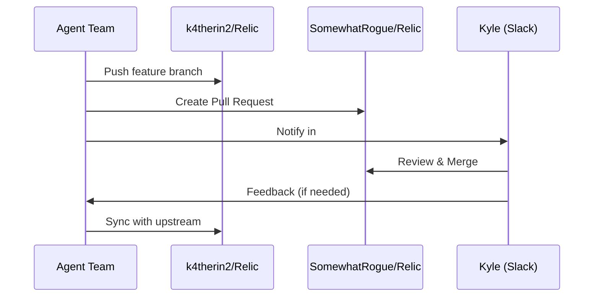

---

*Document created by Agent-Dorian, 2025-12-26*
*Based on Kyle's milestones.md specification*
